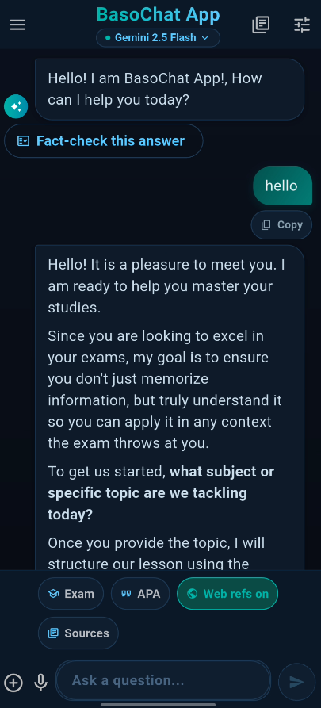

# Baso Chat App

> A feature-rich AI chat application built with Flutter, powered by the Google Gemini API, featuring voice input, file sharing, and local conversation history.



⭐ Star this repo if it helped you

---

## What Is This?

Baso Chat App is a mobile application designed to provide an intelligent conversational interface using the Google Gemini AI. It goes beyond simple text chat by incorporating voice-to-text functionality, file attachments, and a conversational memory backed by a local SQLite database, ensuring your chat history is saved securely on your device.

---

## Features

### 🤖 Intelligent AI Chat
- Powered by the **Google Gemini API** (`google_generative_ai`).
- Context-aware conversations with memory.
- Supports switching between different Gemini models via user settings.
- Markdown rendering for rich text AI responses.

### 🎤 Voice Input & 📎 File Sharing
- Integrated **Speech-to-Text** for hands-free message typing.
- Attach files and media to your prompts using the device's native file picker.
- Intelligent MIME type detection for seamless file handling.

### 💾 Local Conversation Storage
- Full offline history using **SQLite** (`sqflite`).
- Conversations are saved automatically and can be resumed at any time.
- Share outputs directly or copy messages to the clipboard.

### ⚙️ Secure & Configurable
- API keys are securely managed via `.env` configuration.
- Persistent user preferences using `shared_preferences`.
- Network connectivity tracking to handle offline states gracefully.

---

## Tech Stack

| Layer | Technology | Why |
|---|---|---|
| Framework | Flutter / Dart | True cross-platform development (iOS / Android) |
| UI/Markdown | flutter_markdown | Beautiful rendering of AI-generated code and formatted text |
| AI Integration | google_generative_ai | Official Google SDK for Gemini models |
| Database | SQLite (sqflite) | Fast, reliable on-device storage for chat history |
| Voice | speech_to_text | Native speech recognition integration |
| File Handling | file_picker & path_provider | Secure local file access for attachments |
| State/Storage | shared_preferences | Lightweight key-value store for app settings |

---

## Database Implementation

The app stores chat history locally using SQLite.
- `conversations` — Stores the metadata for each chat session.
- `messages` — Stores individual messages (user prompts and AI responses), linked to their parent conversation, enabling persistent multi-turn context.

---

## Getting Started

### Prerequisites
- [Flutter SDK](https://flutter.dev/docs/get-started/install) (Version 3.7.2 or higher compatible)
- A Google AI Studio API key for Gemini.

### 1. Clone and Install

```bash
git clone https://github.com/basobaso03/BasoChatApp.git
cd chatapp

# Install Flutter dependencies
flutter pub get
```

### 2. Configure Environment

Create a `.env` file in the root directory:

```env
GEMINI_API_KEY=your_gemini_api_key_here
```
*(Make sure `.env` is added to your `.gitignore` to keep your API key secure).*

### 3. Run Locally

```bash
# Ensure you have a device connected or an emulator running
flutter run
```

---

## Project Structure

```text
lib/
├── main.dart            # App entry point
├── models/              # Data models (Message, Conversation)
├── screens/             # UI Screens (Chat, History, Settings)
├── services/            # API integration, Database logic
└── widgets/             # Reusable UI components
```

---

## Roadmap

- [ ] Add image generation capabilities
- [ ] Implement cloud sync for chat history
- [ ] Add support for additional LLM providers
- [ ] UI themes (Dark/Light mode toggle)

---

## License

MIT — use it, fork it, build on it.
*By M. Basera Email: baseramarlvin@gmail.com*
